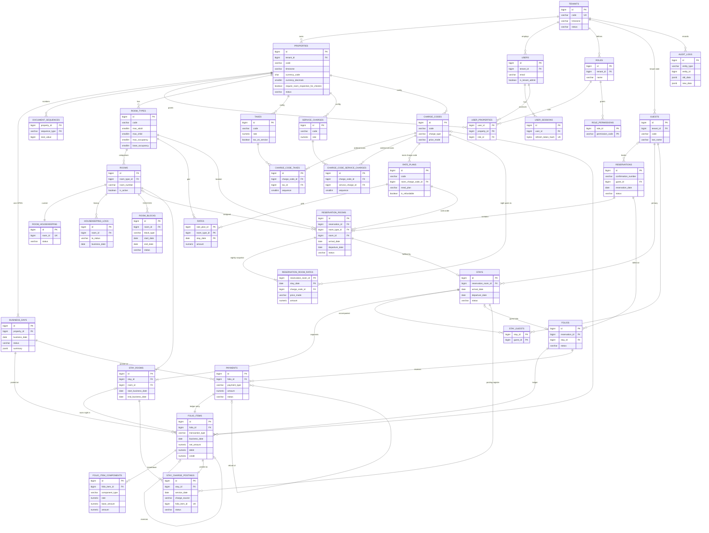

# Database Schema (revision 3): Steps 5–6

> PostgreSQL 16+. Extensions: `btree_gist`. `pg_trgm` comes later for guest search.
> The DDL migrations are generated from this document once it's approved.

## 1. ERD



## 2. Conventions

| Topic | Rule |
|---|---|
| PK | `id bigint GENERATED ALWAYS AS IDENTITY`, except where a composite PK is stated. |
| (T) tenant-scoped | `tenant_id bigint NOT NULL → tenants`, plus `UNIQUE (tenant_id, id)`. |
| (P) property-scoped | `tenant_id` + `property_id bigint NOT NULL`, FK `(tenant_id, property_id) → properties(tenant_id, id)`, plus `UNIQUE (property_id, id)`. |
| Internal FKs | Composite: `(property_id, x_id) → x(property_id, id)`. For guests: `(tenant_id, guest_id) → guests(tenant_id, id)`. **Cross-property and cross-tenant references are impossible.** |
| Enums | `varchar` + `CHECK IN (…)`. A new value such as `price_mode = 'MIXED'` is a one-line migration. |
| Money | `numeric(18,3)` (15 integer digits). **Engine precision comes from `properties.currency_decimals` (0 to 3).** Columns keep three decimals so that 0-, 2- and 3-decimal currencies (IDR, USD, KWD) share one schema; the application rejects amounts with more decimals than the property's currency (migration 00015 widened them from two). |
| Rates | `numeric(7,4)` as a percent (11.0000 = 11%). |
| Names | `*_date` means `date`, and `*_at` means `timestamptz`. |
| [std] | `created_at timestamptz NOT NULL DEFAULT now()`, `created_by bigint NULL`, `updated_at timestamptz NOT NULL DEFAULT now()`, `updated_by bigint NULL` (`*_by` → users). |
| Deletion | Never for business data. Masters use `is_active`. Transactions use status changes or reversals. |

The scope columns, scope FKs and `UNIQUE (…, id)` from the conventions are not repeated below.

---

## 3. Tables

### 3.1 Tenancy

#### `tenants`
| Column | Type | Null | Constraint / note |
|---|---|---|---|
| code | varchar(30) | NO | **UK**. Stored upper-case, and used at login. |
| name | varchar(200) | NO | |
| status | varchar(10) | NO | CHECK IN (`ACTIVE`,`SUSPENDED`) |
| timezone | varchar(64) | NO | The default for new properties |
| created_at, updated_at | timestamptz | NO | |

#### `properties` (T)
| Column | Type | Null | Constraint / note |
|---|---|---|---|
| code | varchar(20) | NO | UK `(tenant_id, code)` |
| name | varchar(200) | NO | |
| address | varchar(300) | YES | |
| city | varchar(100) | YES | |
| country_code | char(2) | YES | |
| timezone | varchar(64) | NO | IANA name |
| currency_code | char(3) | NO | ISO 4217. **Locked** once financial data exists (trigger). |
| currency_decimals | smallint | NO | CHECK `BETWEEN 0 AND 3`. Locked together with the currency. |
| check_in_time, check_out_time | time | NO | Policy and display only |
| require_room_inspection_for_checkin | boolean | NO | DEFAULT false |
| night_audit_marks_occupied_dirty | boolean | NO | DEFAULT true |
| night_audit_earliest_time | time | NO | DEFAULT '20:00'. The earliest local time at which the current BD can be closed on the same calendar date. |
| status | varchar(10) | NO | CHECK IN (`ACTIVE`,`INACTIVE`) |
| [std] | | | |

Trigger `properties_currency_lock`: raises an exception on changing `currency_code` or `currency_decimals` when `EXISTS (SELECT 1 FROM folio_items WHERE property_id = OLD.id)`.

#### `business_days` (P)
| Column | Type | Null | Constraint / note |
|---|---|---|---|
| business_date | date | NO | **UK `(property_id, business_date)`**. This is the FK target for financial rows. |
| status | varchar(10) | NO | CHECK IN (`OPEN`,`CLOSED`) |
| opened_at | timestamptz | NO | |
| opened_by | bigint | YES | NULL means created by the system or by setup |
| closed_at | timestamptz | YES | CHECK `(status = 'CLOSED') = (closed_at IS NOT NULL)` |
| closed_by | bigint | YES | |
| summary | jsonb | YES | Daily closing statistics |
| created_at, updated_at | timestamptz | NO | |

- **UK `(property_id) WHERE status = 'OPEN'`**: exactly one open day
- Trigger: a CLOSED row is immutable. Inserting a row is allowed only if `business_date = (max existing) + 1` or the property has no rows yet, which guarantees there are no gaps.

#### `document_sequences` (P)
| Column | Type | Null | Constraint / note |
|---|---|---|---|
| sequence_type | varchar(20) | NO | CHECK IN (`RESERVATION`,`STAY`,`FOLIO`,`PAYMENT`) |
| prefix | varchar(10) | NO | |
| next_value | bigint | NO | CHECK ≥ 1 |
| updated_at | timestamptz | NO | |

- **PK `(property_id, sequence_type)`** (no `id`)

### 3.2 IAM

#### `users` (T)
| Column | Type | Null | Constraint / note |
|---|---|---|---|
| email | varchar(254) | NO | **UK `(tenant_id, lower(email))`** |
| password_hash | text | NO | argon2id |
| full_name | varchar(200) | NO | |
| is_tenant_admin | boolean | NO | DEFAULT false |
| is_active | boolean | NO | DEFAULT true |
| last_login_at | timestamptz | YES | |
| [std] | | | |

#### `user_sessions`
| Column | Type | Null | Constraint / note |
|---|---|---|---|
| user_id | bigint | NO | FK users ON DELETE CASCADE. IDX. |
| refresh_token_hash | bytea | NO | **UK** |
| expires_at | timestamptz | NO | |
| revoked_at | timestamptz | YES | |
| user_agent | varchar(300) | YES | |
| ip_address | inet | YES | |
| created_at | timestamptz | NO | |

#### `roles` (T)
| Column | Type | Null | Constraint / note |
|---|---|---|---|
| name | varchar(100) | NO | UK `(tenant_id, lower(name))` |
| description | varchar(500) | YES | |
| is_system | boolean | NO | DEFAULT false |
| [std] | | | |

#### `role_permissions`
| Column | Type | Null | Constraint / note |
|---|---|---|---|
| role_id | bigint | NO | PK part. FK roles ON DELETE CASCADE. |
| permission_code | varchar(100) | NO | PK part. Validated against the catalogue in Go. |

#### `user_properties` (T)
| Column | Type | Null | Constraint / note |
|---|---|---|---|
| user_id | bigint | NO | **PK part**. FK `(tenant_id, user_id) → users` |
| property_id | bigint | NO | **PK part**. FK `(tenant_id, property_id) → properties`. IDX. |
| role_id | bigint | NO | FK `(tenant_id, role_id) → roles`. IDX. |
| created_at, created_by | | | |

### 3.3 Rooms and housekeeping

#### `room_types` (P)
| Column | Type | Null | Constraint / note |
|---|---|---|---|
| code | varchar(20) | NO | UK `(property_id, code)` |
| name | varchar(100) | NO | |
| description | text | YES | |
| max_adult | smallint | NO | CHECK ≥ 1 |
| max_child | smallint | NO | CHECK ≥ 0 |
| max_occupancy | smallint | NO | CHECK `max_occupancy BETWEEN 1 AND max_adult + max_child` |
| base_occupancy | smallint | NO | CHECK `base_occupancy BETWEEN 1 AND max_occupancy` |
| sort_order | int | NO | DEFAULT 0 |
| is_active | boolean | NO | |
| [std] | | | |

#### `bed_types` (P): the catalogue of beds of a property (migration 00037)
| Column | Type | Null | Constraint / note |
|---|---|---|---|
| code | varchar(20) | NO | UK `(property_id, code)`; UK `(property_id, id)` for the composite FKs |
| name | varchar(60) | NO | |
| sort_order | int | NO | DEFAULT 0 |
| is_active | boolean | NO | A switched-off bed type is not offered for a new choice; rooms and lines that have it keep it. |
| [std] | | | |

Every property starts with `KING`, `QUEEN`, `DOUBLE`, `TWIN`, `SINGLE` (the migration for existing properties, the property creation hook for new ones). A bed type is **a description, not inventory**: availability stays per room type.

#### `rooms` (P)
| Column | Type | Null | Constraint / note |
|---|---|---|---|
| room_type_id | bigint | NO | FK `(property_id, room_type_id) → room_types`. IDX. |
| room_number | varchar(20) | NO | UK `(property_id, room_number)` |
| floor | varchar(10) | YES | |
| building | varchar(50) | YES | |
| bed_type_id | bigint | YES | FK `(property_id, bed_type_id) → bed_types`. The bed of the room; NULL when none is recorded. |
| is_active | boolean | NO | Decommissioning only. **There is no status column.** |
| [std] | | | |

#### `room_housekeeping` (P)
| Column | Type | Null | Constraint / note |
|---|---|---|---|
| room_id | bigint | NO | **UK**. FK `(property_id, room_id) → rooms`. Created together with the room. |
| status | varchar(10) | NO | CHECK IN (`CLEAN`,`DIRTY`,`CLEANING`,`INSPECTED`) |
| created_at, updated_at | timestamptz | NO | |
| updated_by | bigint | YES | |

- IDX `(property_id, status)`

#### `housekeeping_logs` (P), append-only
| Column | Type | Null | Constraint / note |
|---|---|---|---|
| room_id | bigint | NO | FK → rooms. IDX `(room_id, changed_at DESC)`. |
| from_status, to_status | varchar(10) | NO | CHECK `from_status <> to_status` |
| source | varchar(20) | NO | CHECK IN (`MANUAL`,`CHECK_OUT`,`ROOM_MOVE`,`NIGHT_AUDIT`,`CHECK_IN_REVERSAL`) |
| business_date | date | NO | IDX `(property_id, business_date)` |
| notes | varchar(500) | YES | |
| changed_at | timestamptz | NO | |
| changed_by | bigint | YES | NULL means system |

#### `room_blocks` (P)
| Column | Type | Null | Constraint / note |
|---|---|---|---|
| room_id | bigint | NO | FK → rooms |
| block_type | varchar(3) | NO | CHECK IN (`OOO`,`OOS`) |
| start_date | date | NO | Inclusive |
| end_date | date | NO | **Exclusive**. CHECK `end_date > start_date` |
| reason | varchar(500) | NO | |
| status | varchar(10) | NO | CHECK IN (`ACTIVE`,`CANCELLED`) |
| cancelled_at, cancelled_by | | YES | CHECK `(status = 'CANCELLED') = (cancelled_at IS NOT NULL)` |
| [std] | | | |

- **EXCLUDE `USING gist (room_id WITH =, daterange(start_date, end_date) WITH &&) WHERE (status = 'ACTIVE')`**
- IDX gist `(property_id, daterange(start_date, end_date)) WHERE status = 'ACTIVE'`

### 3.4 Guests

#### `guests` (T)
| Column | Type | Null | Constraint / note |
|---|---|---|---|
| code | varchar(20) | NO | UK `(tenant_id, code)`. Generated by the application (`G` + id) unless imported. |
| origin_property_id | bigint | YES | FK `(tenant_id, origin_property_id) → properties` |
| first_name | varchar(100) | YES | |
| last_name | varchar(100) | NO | |
| email | varchar(254) | YES | IDX `(tenant_id, lower(email))` |
| phone | varchar(30) | YES | E.164. IDX `(tenant_id, phone)`. |
| nationality | char(2) | YES | |
| country_code | char(2) | YES | |
| date_of_birth | date | YES | |
| gender | varchar(12) | YES | CHECK IN (`MALE`,`FEMALE`,`OTHER`,`UNDISCLOSED`) |
| id_type | varchar(30) | YES | |
| id_number | varchar(50) | YES | IDX `(tenant_id, id_number)`. PII. |
| address | varchar(300) | YES | |
| city | varchar(100) | YES | |
| notes | text | YES | |
| [std] | | | |

- IDX `(tenant_id, lower(last_name), lower(first_name))`. Nothing is unique beyond `code`; duplicates are merged later.

### 3.5 Billing configuration

#### `taxes` (P)
| Column | Type | Null | Constraint / note |
|---|---|---|---|
| code | varchar(20) | NO | UK `(property_id, code)` |
| name | varchar(100) | NO | |
| rate | numeric(7,4) | NO | A percent. CHECK `BETWEEN 0 AND 100` |
| tax_on_service | boolean | NO | DEFAULT false |
| gl_account_code | varchar(30) | YES | Tax payable account code of the future COA (text, no FK). CHECK shape `^[A-Z0-9][A-Z0-9._:/-]{0,29}$`. Migration 00019. |
| is_active | boolean | NO | |
| [std] | | | |

There is no `is_inclusive` column (rejected).

#### `service_charges` (P)
| Column | Type | Null | Constraint / note |
|---|---|---|---|
| code | varchar(20) | NO | UK `(property_id, code)` |
| name | varchar(100) | NO | |
| rate | numeric(7,4) | NO | A percent. CHECK `BETWEEN 0 AND 100` |
| gl_account_code | varchar(30) | YES | Service charge payable account code. Same rules. |
| is_active | boolean | NO | |
| [std] | | | |

#### `charge_codes` (P)
| Column | Type | Null | Constraint / note |
|---|---|---|---|
| code | varchar(20) | NO | UK `(property_id, code)`. Seeded with `ROOM`, `ROOM_EXEMPT`, `BREAKFAST`, `RESTAURANT`, `LAUNDRY`, `MINIBAR`, `EXTRA_BED`, `NO_SHOW_FEE`, `CANCEL_FEE`, `OTHER`. |
| name | varchar(100) | NO | |
| charge_type | varchar(20) | NO | CHECK IN (`ROOM`,`FOOD_BEVERAGE`,`SERVICE`,`FEE`,`OTHER`) |
| price_mode | varchar(12) | NO | CHECK IN (`EXCLUSIVE`,`INCLUSIVE`). DEFAULT `EXCLUSIVE`. **Immutable once used** (trigger). |
| default_unit_price | numeric(18,3) | YES | CHECK ≥ 0 |
| is_system | boolean | NO | |
| gl_account_code | varchar(30) | YES | Revenue account code. Same rules. |
| is_active | boolean | NO | |
| [std] | | | |

#### `charge_code_taxes` (P)
| Column | Type | Null | Constraint / note |
|---|---|---|---|
| charge_code_id | bigint | NO | FK → charge_codes |
| tax_id | bigint | NO | FK → taxes. IDX. |
| sequence | smallint | NO | CHECK ≥ 1. This is the calculation and display order. |
| is_active | boolean | NO | |
| created_at, created_by | | | |

- **UK `(charge_code_id, tax_id)`**, **UK `(charge_code_id, sequence) WHERE is_active`**

#### `charge_code_service_charges` (P)
| Column | Type | Null | Constraint / note |
|---|---|---|---|
| charge_code_id | bigint | NO | FK → charge_codes |
| service_charge_id | bigint | NO | FK → service_charges. IDX. |
| sequence | smallint | NO | CHECK ≥ 1 |
| is_active | boolean | NO | |
| created_at, created_by | | | |

- **UK `(charge_code_id, service_charge_id)`**, **UK `(charge_code_id, sequence) WHERE is_active`**

### 3.6 Pricing

#### `rate_plans` (P)
| Column | Type | Null | Constraint / note |
|---|---|---|---|
| code | varchar(20) | NO | UK `(property_id, code)` |
| name | varchar(100) | NO | |
| description | text | YES | |
| meal_plan | varchar(3) | NO | CHECK IN (`RO`,`BB`,`HB`,`FB`,`AI`). Informational in the MVP. |
| cancellation_policy | text | YES | Text in the MVP |
| is_refundable | boolean | NO | DEFAULT true |
| room_charge_code_id | bigint | NO | FK → charge_codes. Its `charge_type` must be `ROOM` (service check). |
| occupancy_kind | varchar(14) | NO | CHECK IN (`PAID`,`COMPLIMENTARY`,`HOUSE_USE`). DEFAULT `PAID`. Fixed at creation (the service has no way to change it), so the history of a plan never changes meaning. A non-PAID plan is priced at zero: no grid rate, no override, the room charge posts as 0. |
| is_active | boolean | NO | |
| [std] | | | |

#### `rates` (P)
| Column | Type | Null | Constraint / note |
|---|---|---|---|
| rate_plan_id | bigint | NO | PK part. FK → rate_plans |
| room_type_id | bigint | NO | PK part. FK → room_types |
| stay_date | date | NO | PK part |
| amount | numeric(18,3) | NO | CHECK ≥ 0. Expressed in the room charge code's price mode. |
| updated_at, updated_by | | | |

- **PK `(rate_plan_id, room_type_id, stay_date)`**

### 3.7 Reservations

#### `reservations` (P)
| Column | Type | Null | Constraint / note |
|---|---|---|---|
| confirmation_number | varchar(20) | NO | UK `(property_id, confirmation_number)` |
| guest_id | bigint | YES | The booker. FK `(tenant_id, guest_id) → guests`. CHECK `status = 'DRAFT' OR guest_id IS NOT NULL`. IDX. |
| reservation_date | date | NO | The BD at creation |
| source | varchar(20) | NO | CHECK IN (`WALK_IN`,`PHONE`,`EMAIL`,`WEBSITE`,`OTA`,`AGENT`,`OTHER`) |
| market | varchar(30) | YES | |
| status | varchar(10) | NO | CHECK IN (`DRAFT`,`CONFIRMED`,`CANCELLED`) |
| special_request, remarks | text | YES | |
| confirmed_at, confirmed_by | | YES | |
| cancelled_at, cancelled_by | | YES | CHECK `(status = 'CANCELLED') = (cancelled_at IS NOT NULL)` |
| cancellation_reason | varchar(500) | YES | |
| version | int | NO | DEFAULT 1 |
| [std] | | | |

- IDX `(property_id, reservation_date)`

#### `reservation_rooms` (P)
| Column | Type | Null | Constraint / note |
|---|---|---|---|
| reservation_id | bigint | NO | FK → reservations. IDX. |
| guest_id | bigint | YES | The occupant. NULL means the booker. |
| room_type_id | bigint | NO | The booked type |
| room_id | bigint | YES | Assigned room |
| rate_plan_id | bigint | NO | |
| arrival_date | date | NO | |
| departure_date | date | NO | CHECK `departure_date > arrival_date` |
| adult_count | smallint | NO | CHECK ≥ 1 |
| child_count | smallint | NO | CHECK ≥ 0 |
| occupancy_reason | varchar(500) | YES | Why the room is free. Set exactly when the rate plan is `COMPLIMENTARY` or `HOUSE_USE` (a service rule, since the kind lives on the plan). |
| requested_bed_type_id | bigint | YES | FK `(property_id, requested_bed_type_id) → bed_types`. The bed the guest asked for: a request, not a hold; any room of the booked type can still be assigned. |
| status | varchar(12) | NO | CHECK IN (`DRAFT`,`CONFIRMED`,`CHECKED_IN`,`COMPLETED`,`CANCELLED`,`NO_SHOW`) |
| cancelled_at, cancelled_by, cancellation_reason | | YES | CHECK `(status = 'CANCELLED') = (cancelled_at IS NOT NULL)` |
| no_show_at, no_show_by | | YES | CHECK `(status = 'NO_SHOW') = (no_show_at IS NOT NULL)` |
| [std] | | | |

- **EXCLUDE `USING gist (room_id WITH =, daterange(arrival_date, departure_date) WITH &&) WHERE (status = 'CONFIRMED' AND room_id IS NOT NULL)`**
- IDX gist `(property_id, room_type_id, daterange(arrival_date, departure_date)) WHERE status = 'CONFIRMED'`
- IDX `(property_id, arrival_date) WHERE status = 'CONFIRMED'` (arrivals and unresolved arrivals)

#### `reservation_room_rates` (P): the nightly pricing snapshot
| Column | Type | Null | Constraint / note |
|---|---|---|---|
| reservation_room_id | bigint | NO | **PK part**. FK → reservation_rooms ON DELETE CASCADE |
| stay_date | date | NO | **PK part** |
| rate_plan_id | bigint | NO | FK → rate_plans |
| charge_code_id | bigint | NO | FK → charge_codes (snapshot of the plan's room code) |
| price_mode | varchar(12) | NO | Snapshot of the charge code |
| base_rate | numeric(18,3) | YES | Grid price. NULL when there was no grid price. |
| discount_amount | numeric(18,3) | NO | DEFAULT 0. CHECK ≥ 0 |
| amount | numeric(18,3) | NO | Agreed price per night. CHECK ≥ 0 |
| is_override | boolean | NO | CHECK `is_override OR (base_rate IS NOT NULL AND amount = base_rate − discount_amount)` |
| created_at, created_by, updated_at, updated_by | | | |

- Service rule: a row whose night has a POSTED register entry can't be edited (C6).

### 3.8 Front desk

#### `stays` (P)
| Column | Type | Null | Constraint / note |
|---|---|---|---|
| stay_number | varchar(20) | NO | UK `(property_id, stay_number)` |
| reservation_room_id | bigint | NO | FK → reservation_rooms. **UK `WHERE status <> 'CANCELLED'`** |
| guest_id | bigint | NO | Primary guest. FK → guests. IDX `(tenant_id, guest_id)`. |
| arrival_date | date | NO | The BD at check-in |
| departure_date | date | NO | Current expected. CHECK `departure_date > arrival_date` |
| adult_count | smallint | NO | CHECK ≥ 1 |
| child_count | smallint | NO | CHECK ≥ 0 |
| status | varchar(12) | NO | CHECK IN (`OPEN`,`CHECKED_OUT`,`CANCELLED`) |
| actual_check_in_at | timestamptz | NO | |
| actual_check_in_by | bigint | YES | |
| actual_check_out_at | timestamptz | YES | CHECK `(status = 'CHECKED_OUT') = (actual_check_out_at IS NOT NULL)` |
| actual_check_out_by | bigint | YES | |
| remarks | text | YES | |
| version | int | NO | |
| [std] | | | |

- IDX `(property_id, departure_date) WHERE status = 'OPEN'` (due-outs and unresolved departures), IDX `(property_id) WHERE status = 'OPEN'`

#### `stay_rooms` (P)
| Column | Type | Null | Constraint / note |
|---|---|---|---|
| stay_id | bigint | NO | FK → stays. IDX. |
| room_id | bigint | NO | FK → rooms |
| check_in_at | timestamptz | NO | |
| check_out_at | timestamptz | YES | CHECK `check_out_at >= check_in_at` |
| start_business_date | date | NO | |
| end_business_date | date | YES | CHECK `end_business_date >= start_business_date`. CHECK `(check_out_at IS NULL) = (end_business_date IS NULL)` |
| move_reason | varchar(500) | YES | |
| created_at, created_by, updated_at | | | |

- **UK `(room_id) WHERE check_out_at IS NULL`** (a room holds at most one open segment)
- **UK `(stay_id) WHERE check_out_at IS NULL`** (a stay has at most one open segment)
- IDX `(room_id, start_business_date)`

#### `stay_guests` (P)
| Column | Type | Null | Constraint / note |
|---|---|---|---|
| stay_id | bigint | NO | PK part |
| guest_id | bigint | NO | PK part. IDX `(tenant_id, guest_id)`. |
| created_at, created_by | | | |

### 3.9 Ledger

#### `folios` (P)
| Column | Type | Null | Constraint / note |
|---|---|---|---|
| folio_number | varchar(20) | NO | UK `(property_id, folio_number)` |
| reservation_id | bigint | NO | FK → reservations. IDX. |
| stay_id | bigint | YES | FK → stays |
| folio_type | varchar(10) | NO | CHECK IN (`GUEST`). `MASTER` and `HOUSE` come later. |
| status | varchar(10) | NO | CHECK IN (`OPEN`,`CLOSED`) |
| opened_at | timestamptz | NO | |
| closed_at, closed_by | | YES | CHECK `(status = 'CLOSED') = (closed_at IS NOT NULL)` |
| version | int | NO | |
| [std] | | | |

- **UK `(stay_id) WHERE folio_type = 'GUEST' AND stay_id IS NOT NULL`** (one guest folio per stay)
- **UK `(reservation_id) WHERE stay_id IS NULL AND status = 'OPEN'`** (one open unlinked folio per reservation)
- IDX `(property_id) WHERE status = 'OPEN'`

#### `folio_items` (P), immutable
| Column | Type | Null | Constraint / note |
|---|---|---|---|
| folio_id | bigint | NO | FK → folios. IDX `(folio_id, transaction_at)`. |
| business_date | date | NO | **FK `(property_id, business_date) → business_days`**. IDX `(property_id, business_date)`. |
| transaction_at | timestamptz | NO | Server time |
| service_date | date | NO | The night or day the service was consumed. CHECK `service_date <= business_date` |
| transaction_type | varchar(12) | NO | CHECK IN (`CHARGE`,`ADJUSTMENT`,`PAYMENT`,`REFUND`,`REVERSAL`) |
| charge_code_id | bigint | YES | FK → charge_codes. IDX `(property_id, charge_code_id, business_date)`. |
| payment_id | bigint | YES | FK → payments. **UK WHERE NOT NULL** |
| reverses_item_id | bigint | YES | FK → folio_items. **UK WHERE NOT NULL** |
| stay_id | bigint | YES | FK → stays |
| stay_room_id | bigint | YES | FK → stay_rooms (the room for a room night) |
| reference_type | varchar(30) | YES | Only for external or future sources |
| reference_id | varchar(64) | YES | CHECK `(reference_type IS NULL) = (reference_id IS NULL)` |
| description | varchar(300) | NO | |
| quantity | numeric(10,3) | NO | CHECK ≠ 0 |
| unit_price | numeric(18,3) | NO | As entered, in `price_mode` terms |
| price_mode | varchar(12) | NO | CHECK IN (`EXCLUSIVE`,`INCLUSIVE`) |
| revenue_account_code | varchar(30) | YES | Snapshot of the charge code's account when posted; a reversal copies the original's. NULL for payments and unmapped codes. |
| base_amount | numeric(18,3) | NO | Signed, revenue perspective |
| discount_amount | numeric(18,3) | NO | DEFAULT 0 |
| net_amount | numeric(18,3) | NO | Includes `rounding_adjustment` |
| rounding_adjustment | numeric(18,3) | NO | DEFAULT 0. Non-zero only for INCLUSIVE. |
| service_charge_total | numeric(18,3) | NO | DEFAULT 0 (= Σ components) |
| tax_total | numeric(18,3) | NO | DEFAULT 0 (= Σ components) |
| debit | numeric(18,3) | NO | CHECK ≥ 0 |
| credit | numeric(18,3) | NO | CHECK ≥ 0 |
| source | varchar(15) | NO | CHECK IN (`MANUAL`,`ROOM_POSTING`,`SYSTEM`,`INTEGRATION`) |
| reason | varchar(500) | YES | |
| idempotency_key | varchar(100) | YES | UK `(property_id, idempotency_key) WHERE NOT NULL` |
| created_at | timestamptz | NO | |
| created_by | bigint | YES | |

CHECK constraints:
```
NOT (debit > 0 AND credit > 0)
debit - credit = net_amount + service_charge_total + tax_total
(price_mode = 'EXCLUSIVE' AND rounding_adjustment = 0 AND net_amount = base_amount - discount_amount)
  OR (price_mode = 'INCLUSIVE' AND debit - credit = base_amount - discount_amount)
transaction_type IN ('CHARGE','ADJUSTMENT') → charge_code_id IS NOT NULL AND payment_id IS NULL
transaction_type = 'CHARGE'     → credit = 0
transaction_type = 'ADJUSTMENT' → reason IS NOT NULL
transaction_type = 'PAYMENT'    → payment_id IS NOT NULL AND credit > 0 AND debit = 0 AND charge_code_id IS NULL
transaction_type = 'REFUND'     → payment_id IS NOT NULL AND debit > 0 AND credit = 0 AND charge_code_id IS NULL
(transaction_type = 'REVERSAL') = (reverses_item_id IS NOT NULL)
```
Triggers:
- `BEFORE UPDATE OR DELETE` raises an exception
- `DEFERRABLE INITIALLY DEFERRED` constraint trigger: `service_charge_total` and `tax_total` equal the component sums by type
- The application DB role has no UPDATE or DELETE grant on this table

#### `folio_item_components` (P), immutable
| Column | Type | Null | Constraint / note |
|---|---|---|---|
| folio_item_id | bigint | NO | FK → folio_items. IDX. |
| component_type | varchar(15) | NO | CHECK IN (`SERVICE_CHARGE`,`TAX`) |
| tax_id | bigint | YES | FK → taxes. CHECK `(component_type = 'TAX') = (tax_id IS NOT NULL)` |
| service_charge_id | bigint | YES | FK → service_charges. CHECK `(component_type = 'SERVICE_CHARGE') = (service_charge_id IS NOT NULL)` |
| code | varchar(20) | NO | Snapshot |
| name | varchar(100) | NO | Snapshot |
| rate | numeric(7,4) | NO | Snapshot (a percent) |
| tax_on_service | boolean | YES | Snapshot (taxes only). CHECK `(component_type = 'TAX') = (tax_on_service IS NOT NULL)` |
| gl_account_code | varchar(30) | YES | Snapshot of the tax / service charge account when posted; a reversal copies the original's. |
| base_amount | numeric(18,3) | NO | The taxable base used |
| amount | numeric(18,3) | NO | Signed like the item |
| sequence | smallint | NO | |
| created_at | timestamptz | NO | |

- UK `(folio_item_id, component_type, sequence)`. IDX `(property_id, tax_id)`. Append-only trigger.

#### `payments` (P)
| Column | Type | Null | Constraint / note |
|---|---|---|---|
| payment_number | varchar(20) | NO | UK `(property_id, payment_number)` |
| folio_id | bigint | NO | FK → folios. IDX. |
| payment_type | varchar(10) | NO | CHECK IN (`PAYMENT`,`REFUND`) |
| payment_method | varchar(15) | NO | CHECK IN (`CASH`,`CARD`,`BANK_TRANSFER`,`OTHER`) |
| amount | numeric(18,3) | NO | CHECK > 0. The currency is the property's. |
| paid_at | timestamptz | NO | Server time |
| business_date | date | NO | FK → business_days. IDX `(property_id, business_date)`. |
| reference_number | varchar(100) | YES | Never a card number (PAN) |
| refund_of_payment_id | bigint | YES | FK → payments. IDX. CHECK `(payment_type = 'REFUND') = (refund_of_payment_id IS NOT NULL)` |
| status | varchar(10) | NO | CHECK IN (`POSTED`,`VOIDED`) |
| voided_at, voided_by, void_reason | | YES | CHECK `(status = 'VOIDED') = (voided_at IS NOT NULL)` |
| idempotency_key | varchar(100) | YES | UK `(property_id, idempotency_key) WHERE NOT NULL` |
| remarks | varchar(500) | YES | |
| created_at, created_by | | | |

There is no `currency_code` column (rejected).

#### `stay_charge_postings` (P): the posting register
| Column | Type | Null | Constraint / note |
|---|---|---|---|
| stay_id | bigint | NO | FK → stays |
| stay_room_id | bigint | NO | FK → stay_rooms (traceability only) |
| service_date | date | NO | The night |
| charge_source | varchar(12) | NO | CHECK IN (`ROOM_NIGHT`). `PACKAGE` and `RECURRING` come later. |
| source_ref_id | bigint | YES | NULL for `ROOM_NIGHT` |
| charge_code_id | bigint | NO | FK → charge_codes (traceability only) |
| folio_item_id | bigint | NO | FK → folio_items. **UK** |
| business_date | date | NO | The posting BD. FK → business_days. |
| posting_trigger | varchar(12) | NO | CHECK IN (`NIGHT_AUDIT`,`MANUAL`,`CHECK_OUT`,`RECOVERY`) |
| status | varchar(10) | NO | CHECK IN (`POSTED`,`REVERSED`) |
| reversal_item_id | bigint | YES | FK → folio_items. CHECK `(status = 'REVERSED') = (reversal_item_id IS NOT NULL)` |
| created_at, created_by | | | |

- **UK `(stay_id, service_date, charge_source, COALESCE(source_ref_id, 0)) WHERE status = 'POSTED'`**, which is the room-charge idempotency key (see review A4)
- IDX `(property_id, service_date)`
- Only `status` and `reversal_item_id` can change, from POSTED to REVERSED (trigger)

### 3.10 Audit

#### `audit_logs` (T), append-only, **no FKs**
| Column | Type | Null | Constraint / note |
|---|---|---|---|
| property_id | bigint | YES | |
| business_date | date | YES | |
| user_id | bigint | YES | NULL means system |
| action | varchar(100) | NO | For example `stay.checked_in` or `night_audit.completed` |
| entity_type | varchar(50) | NO | |
| entity_id | bigint | NO | |
| old_data | jsonb | YES | |
| new_data | jsonb | YES | |
| request_id | varchar(64) | YES | |
| ip_address | inet | YES | |
| created_at | timestamptz | NO | |

- IDX `(tenant_id, entity_type, entity_id, created_at DESC)`, IDX `(property_id, created_at DESC)`, IDX `(user_id, created_at DESC)`. Monthly partitions can be added later.

---

## 4. Inventory (34 tables)

| Area | Tables |
|---|---|
| Tenancy (4) | tenants, properties, business_days, document_sequences |
| IAM (5) | users, user_sessions, roles, role_permissions, user_properties |
| Rooms (6) | room_types, bed_types, rooms, room_housekeeping, housekeeping_logs, room_blocks |
| Guests (1) | guests |
| Billing config (5) | taxes, service_charges, charge_codes, charge_code_taxes, charge_code_service_charges |
| Pricing (2) | rate_plans, rates |
| Reservations (3) | reservations, reservation_rooms, reservation_room_rates |
| Front desk (3) | stays, stay_rooms, stay_guests |
| Ledger (5) | folios, folio_items, folio_item_components, payments, stay_charge_postings |
| Audit (1) | audit_logs |

## 5. Future modules: extension points (no redesign)

| Module | Plugs in via |
|---|---|
| POS | `folio_items` (`source = INTEGRATION`, `reference_type` and `reference_id`, its own charge codes). `ChargeCalculationEngine.Verify` checks its breakdown. |
| Packages / recurring | New `rate_plan_packages` and `stay_recurring_charges` tables. `stay_charge_postings.charge_source = PACKAGE` or `RECURRING` with `source_ref_id`. A new ExpectedChargeEngine source. |
| Accounting | GL mapping tables (charge code, tax, payment method → account). Exports per CLOSED `business_days`. |
| Channel manager / booking engine | Reservation service (`source = OTA`/`WEBSITE`), availability engine, `rate_restrictions`. |
| Payment gateway | `payment_transactions` linked to `payments`. |
| Keylock / PABX / IPTV / Mobile | Domain events from check-in, move and check-out, through a future `outbox_events` table. |
| Cashier shifts | `cashier_shifts`, plus a night-audit check registered in the check registry. |
| Multi-currency | Additive payment columns (`transaction_currency`, `exchange_rate`). |
| Effective-dated tax rates | `tax_rate_periods`. Only the resolver changes. |
