# Database Design (revision 2)

> PostgreSQL 16+. Extensions: `btree_gist` (for exclusion constraints), `citext` (not used; we use `lower()` indexes instead), and later `pg_trgm` for guest search.
> DDL is generated in Phase 4 once this revision is approved.

## 1. ERD

```mermaid
erDiagram
    TENANTS ||--o{ PROPERTIES : owns
    TENANTS ||--o{ USERS : employs
    TENANTS ||--o{ ROLES : defines
    TENANTS ||--o{ GUESTS : "tenant-wide"
    PROPERTIES ||--|{ BUSINESS_DAYS : "day management"
    PROPERTIES ||--o{ DOCUMENT_SEQUENCES : numbers
    USERS ||--o{ USER_SESSIONS : has
    USERS ||--o{ USER_PROPERTIES : "has access"
    PROPERTIES ||--o{ USER_PROPERTIES : "grants access"
    ROLES ||--o{ USER_PROPERTIES : "role at property"
    ROLES ||--o{ ROLE_PERMISSIONS : grants

    PROPERTIES ||--o{ ROOM_TYPES : has
    ROOM_TYPES ||--o{ ROOMS : categorises
    ROOMS ||--|| ROOM_HOUSEKEEPING : "current state"
    ROOMS ||--o{ HOUSEKEEPING_LOGS : history
    ROOMS ||--o{ ROOM_BLOCKS : "OOO/OOS"

    PROPERTIES ||--o{ TAXES : configures
    PROPERTIES ||--o{ SERVICE_CHARGES : configures
    PROPERTIES ||--o{ CHARGE_CODES : configures
    CHARGE_CODES ||--o{ CHARGE_CODE_TAXES : attracts
    TAXES ||--o{ CHARGE_CODE_TAXES : "applied via"
    CHARGE_CODES ||--o{ CHARGE_CODE_SERVICE_CHARGES : attracts
    SERVICE_CHARGES ||--o{ CHARGE_CODE_SERVICE_CHARGES : "applied via"

    CHARGE_CODES ||--o{ RATE_PLANS : "room revenue code"
    RATE_PLANS ||--o{ RATES : "priced by"
    ROOM_TYPES ||--o{ RATES : "priced by"

    GUESTS |o--o{ RESERVATIONS : books
    RESERVATIONS ||--|{ RESERVATION_ROOMS : contains
    ROOM_TYPES ||--o{ RESERVATION_ROOMS : "booked type"
    ROOMS |o--o{ RESERVATION_ROOMS : "assigned"
    RATE_PLANS ||--o{ RESERVATION_ROOMS : "sold under"
    RESERVATION_ROOMS ||--|{ RESERVATION_ROOM_RATES : "nightly price"
    RATE_PLANS ||--o{ RESERVATION_ROOM_RATES : "night priced under"

    RESERVATION_ROOMS ||--o| STAYS : "fulfilled by"
    GUESTS ||--o{ STAYS : "primary guest"
    STAYS ||--|{ STAY_ROOMS : segments
    ROOMS ||--o{ STAY_ROOMS : "occupied in"
    STAYS ||--o{ STAY_GUESTS : accompanied
    GUESTS ||--o{ STAY_GUESTS : ""

    RESERVATIONS ||--o{ FOLIOS : "billed on"
    STAYS |o--o{ FOLIOS : "linked at check-in"
    FOLIOS ||--o{ FOLIO_ITEMS : ledger
    CHARGE_CODES |o--o{ FOLIO_ITEMS : classifies
    FOLIO_ITEMS ||--o{ FOLIO_ITEM_COMPONENTS : breakdown
    TAXES |o--o{ FOLIO_ITEM_COMPONENTS : "tax applied"
    SERVICE_CHARGES |o--o{ FOLIO_ITEM_COMPONENTS : "service applied"
    FOLIO_ITEMS |o--o| FOLIO_ITEMS : reverses
    FOLIOS ||--o{ PAYMENTS : receives
    PAYMENTS ||--|| FOLIO_ITEMS : "ledger entry"
    PAYMENTS |o--o{ PAYMENTS : "refund of"
    BUSINESS_DAYS ||--o{ FOLIO_ITEMS : "posted on"
    BUSINESS_DAYS ||--o{ PAYMENTS : "posted on"
    TENANTS ||--o{ AUDIT_LOGS : records

    TENANTS {
        bigint id PK
        varchar code UK
        varchar status
    }
    PROPERTIES {
        bigint id PK
        bigint tenant_id FK
        varchar code
        varchar timezone
        char currency_code
        smallint currency_decimals
        boolean require_room_inspection_for_checkin
        boolean night_audit_marks_occupied_dirty
    }
    BUSINESS_DAYS {
        bigint id PK
        bigint property_id FK
        date business_date UK
        varchar status
        timestamptz closed_at
        jsonb summary
    }
    DOCUMENT_SEQUENCES {
        bigint property_id PK
        varchar sequence_type PK
        bigint next_value
    }
    USERS {
        bigint id PK
        bigint tenant_id FK
        varchar email
        boolean is_tenant_admin
    }
    USER_SESSIONS {
        bigint id PK
        bigint user_id FK
        bytea refresh_token_hash UK
    }
    ROLES {
        bigint id PK
        bigint tenant_id FK
        varchar name
    }
    ROLE_PERMISSIONS {
        bigint role_id PK
        varchar permission_code PK
    }
    USER_PROPERTIES {
        bigint user_id PK
        bigint property_id PK
        bigint role_id FK
    }
    ROOM_TYPES {
        bigint id PK
        bigint property_id FK
        varchar code
        smallint max_occupancy
    }
    ROOMS {
        bigint id PK
        bigint room_type_id FK
        varchar room_number
        boolean is_active
    }
    ROOM_HOUSEKEEPING {
        bigint room_id PK
        varchar status
    }
    HOUSEKEEPING_LOGS {
        bigint id PK
        bigint room_id FK
        varchar to_status
        date business_date
    }
    ROOM_BLOCKS {
        bigint id PK
        bigint room_id FK
        varchar block_type
        date start_date
        date end_date
        varchar status
    }
    GUESTS {
        bigint id PK
        bigint tenant_id FK
        bigint origin_property_id FK
        varchar last_name
    }
    TAXES {
        bigint id PK
        bigint property_id FK
        varchar code
        numeric rate_percent
        boolean tax_on_service
    }
    SERVICE_CHARGES {
        bigint id PK
        bigint property_id FK
        varchar code
        numeric rate_percent
    }
    CHARGE_CODES {
        bigint id PK
        bigint property_id FK
        varchar code
        varchar category
        varchar default_price_mode
    }
    CHARGE_CODE_TAXES {
        bigint charge_code_id PK
        bigint tax_id PK
    }
    CHARGE_CODE_SERVICE_CHARGES {
        bigint charge_code_id PK
        bigint service_charge_id PK
    }
    RATE_PLANS {
        bigint id PK
        bigint room_charge_code_id FK
        varchar code
        varchar price_mode
    }
    RATES {
        bigint rate_plan_id PK
        bigint room_type_id PK
        date stay_date PK
        numeric amount
    }
    RESERVATIONS {
        bigint id PK
        varchar confirmation_number
        bigint booker_guest_id FK
        varchar status
    }
    RESERVATION_ROOMS {
        bigint id PK
        bigint reservation_id FK
        bigint room_type_id FK
        bigint room_id FK
        date arrival_date
        date departure_date
        varchar status
    }
    RESERVATION_ROOM_RATES {
        bigint reservation_room_id PK
        date stay_date PK
        numeric amount
        varchar price_mode
    }
    STAYS {
        bigint id PK
        bigint reservation_room_id FK
        date departure_date
        varchar status
    }
    STAY_ROOMS {
        bigint id PK
        bigint stay_id FK
        bigint room_id FK
        timestamptz ended_at
    }
    STAY_GUESTS {
        bigint stay_id PK
        bigint guest_id PK
    }
    FOLIOS {
        bigint id PK
        bigint reservation_id FK
        bigint stay_id FK
        varchar status
    }
    FOLIO_ITEMS {
        bigint id PK
        bigint folio_id FK
        varchar item_type
        date business_date FK
        numeric net_amount
        numeric tax_amount
        numeric amount
    }
    FOLIO_ITEM_COMPONENTS {
        bigint id PK
        bigint folio_item_id FK
        varchar component_type
        numeric rate_percent
        numeric amount
    }
    PAYMENTS {
        bigint id PK
        bigint folio_id FK
        varchar payment_type
        numeric amount
        varchar status
    }
    AUDIT_LOGS {
        bigint id PK
        varchar entity_type
        bigint entity_id
        date business_date
        jsonb changes
    }
```



## 2. Global conventions

| Convention | Rule |
|---|---|
| PK | `id bigint GENERATED ALWAYS AS IDENTITY`. Mapping and child tables use composite PKs. |
| Scoping | **(T)** means tenant-scoped: `tenant_id NOT NULL → tenants`, plus `UNIQUE (tenant_id, id)`. **(P)** means property-scoped: `tenant_id` + `property_id NOT NULL`, FK `(tenant_id, property_id) → properties(tenant_id, id)`, plus `UNIQUE (property_id, id)`. |
| Internal refs | Property-scoped references use composite FKs: `(property_id, x_id) → x(property_id, id)`. References to guests use `(tenant_id, guest_id) → guests(tenant_id, id)`. **A cross-property or cross-tenant reference can't be stored.** |
| Enums | `varchar` + `CHECK (… IN (…))`. Adding a value is a single-statement migration. |
| Money | `numeric(18,2)`. Rates use `numeric(7,4)` as a **percent** (11.0000 = 11%). |
| Dates / instants | `date` for business dates. `timestamptz` for events. |
| [std] | `created_at timestamptz NOT NULL DEFAULT now()`, `created_by bigint NULL`, `updated_at timestamptz NOT NULL DEFAULT now()`, `updated_by bigint NULL`. `*_by` columns are FK → users. |
| Deletes | Business data is never hard-deleted. Master data is deactivated, and transactions change status or are reversed. |

Below, the implied `id`, `tenant_id`, `property_id`, the scoping FKs, and `UNIQUE (…, id)` are not repeated.

---

## 3. Tables

### 3.1 Tenancy

**`tenants`**
| Column | Type | Null | Notes |
|---|---|---|---|
| code | varchar(50) | NO | UK. Used at login. |
| name | varchar(200) | NO | |
| status | varchar(20) | NO | CHECK IN (`ACTIVE`,`SUSPENDED`) |
| created_at, updated_at | timestamptz | NO | |

**`properties`** (T)
| Column | Type | Null | Notes |
|---|---|---|---|
| code | varchar(20) | NO | UK `(tenant_id, code)` |
| name | varchar(200) | NO | |
| timezone | varchar(64) | NO | IANA name, validated against Go's tzdata |
| currency_code | char(3) | NO | ISO 4217. Immutable once transactions exist (trigger). |
| currency_decimals | smallint | NO | CHECK `BETWEEN 0 AND 3`. Immutable with currency_code. |
| check_in_time, check_out_time | time | NO | Policy and display only |
| require_room_inspection_for_checkin | boolean | NO | DEFAULT false |
| night_audit_marks_occupied_dirty | boolean | NO | DEFAULT true |
| address_line, city, phone, email | varchar | YES | |
| country_code | char(2) | YES | |
| is_active | boolean | NO | DEFAULT true |
| [std] | | | |

**`business_days`** (P)
| Column | Type | Null | Notes |
|---|---|---|---|
| business_date | date | NO | UK `(property_id, business_date)` (the FK target for financial rows) |
| status | varchar(10) | NO | CHECK IN (`OPEN`,`CLOSED`) |
| opened_at | timestamptz | NO | |
| closed_at | timestamptz | YES | CHECK `(status = 'CLOSED') = (closed_at IS NOT NULL)` |
| closed_by | bigint | YES | |
| summary | jsonb | YES | Night-audit statistics |

- **UK `(property_id) WHERE status = 'OPEN'`**, so there's exactly one current business date
- Trigger: a `CLOSED` row can't be updated

**`document_sequences`** (P)
| Column | Type | Null | Notes |
|---|---|---|---|
| sequence_type | varchar(20) | NO | CHECK IN (`RESERVATION`,`STAY`,`FOLIO`,`PAYMENT`) |
| prefix | varchar(10) | NO | |
| next_value | bigint | NO | CHECK ≥ 1 |
| updated_at | timestamptz | NO | |

- PK `(property_id, sequence_type)` (no `id` column)

### 3.2 IAM

**`users`** (T)
| Column | Type | Null | Notes |
|---|---|---|---|
| email | varchar(254) | NO | **UK `(tenant_id, lower(email))`** |
| password_hash | text | NO | argon2id |
| full_name | varchar(200) | NO | |
| is_tenant_admin | boolean | NO | DEFAULT false |
| is_active | boolean | NO | |
| last_login_at | timestamptz | YES | |
| [std] | | | |

**`user_sessions`**
| Column | Type | Null | Notes |
|---|---|---|---|
| user_id | bigint | NO | FK users ON DELETE CASCADE. IDX. |
| refresh_token_hash | bytea | NO | UK |
| expires_at | timestamptz | NO | |
| revoked_at | timestamptz | YES | |
| user_agent | varchar(300) | YES | |
| ip_address | inet | YES | |
| created_at | timestamptz | NO | |

**`roles`** (T)
| Column | Type | Null | Notes |
|---|---|---|---|
| name | varchar(100) | NO | UK `(tenant_id, lower(name))` |
| description | varchar(500) | YES | |
| is_system | boolean | NO | |
| [std] | | | |

**`role_permissions`**
| Column | Type | Null | Notes |
|---|---|---|---|
| role_id | bigint | NO | PK part. FK roles ON DELETE CASCADE. |
| permission_code | varchar(100) | NO | PK part |

**`user_properties`** (T)
| Column | Type | Null | Notes |
|---|---|---|---|
| user_id | bigint | NO | PK part. FK `(tenant_id, user_id) → users` |
| property_id | bigint | NO | PK part. FK `(tenant_id, property_id) → properties` |
| role_id | bigint | NO | FK `(tenant_id, role_id) → roles` |
| created_at, created_by | | | |

- PK `(user_id, property_id)`, IDX `(property_id)`, IDX `(role_id)`

### 3.3 Rooms and housekeeping

**`room_types`** (P)
| Column | Type | Null | Notes |
|---|---|---|---|
| code | varchar(20) | NO | UK `(property_id, code)` |
| name | varchar(100) | NO | |
| description | text | YES | |
| max_adults | smallint | NO | CHECK ≥ 1 |
| max_children | smallint | NO | CHECK ≥ 0 |
| max_occupancy | smallint | NO | CHECK `BETWEEN 1 AND max_adults + max_children` |
| sort_order | int | NO | |
| is_active | boolean | NO | |
| [std] | | | |

**`rooms`** (P)
| Column | Type | Null | Notes |
|---|---|---|---|
| room_type_id | bigint | NO | FK `(property_id, room_type_id) → room_types`. IDX. |
| room_number | varchar(20) | NO | UK `(property_id, room_number)` |
| floor | varchar(10) | YES | |
| building | varchar(50) | YES | |
| is_active | boolean | NO | Decommissioned. **There is no occupancy status.** |
| [std] | | | |

**`room_housekeeping`** (P)
| Column | Type | Null | Notes |
|---|---|---|---|
| room_id | bigint | NO | **PK**. FK `(property_id, room_id) → rooms`. Created together with the room. |
| status | varchar(12) | NO | CHECK IN (`CLEAN`,`DIRTY`,`CLEANING`,`INSPECTED`) |
| updated_at | timestamptz | NO | |
| updated_by | bigint | YES | |

- IDX `(property_id, status)`

**`housekeeping_logs`** (P), append-only
| Column | Type | Null | Notes |
|---|---|---|---|
| room_id | bigint | NO | FK → rooms |
| from_status, to_status | varchar(12) | NO | CHECK `from_status <> to_status` |
| source | varchar(20) | NO | CHECK IN (`MANUAL`,`CHECKOUT`,`ROOM_MOVE`,`NIGHT_AUDIT`,`CHECKIN_REVERSAL`) |
| business_date | date | NO | |
| notes | varchar(500) | YES | |
| changed_at | timestamptz | NO | |
| changed_by | bigint | YES | NULL means system |

- IDX `(room_id, changed_at DESC)`, IDX `(property_id, business_date)`

**`room_blocks`** (P)
| Column | Type | Null | Notes |
|---|---|---|---|
| room_id | bigint | NO | FK → rooms |
| block_type | varchar(3) | NO | CHECK IN (`OOO`,`OOS`) |
| start_date | date | NO | Inclusive |
| end_date | date | NO | **Exclusive**. CHECK `end_date > start_date` |
| reason | varchar(500) | NO | |
| status | varchar(10) | NO | CHECK IN (`ACTIVE`,`CANCELLED`) |
| cancelled_at, cancelled_by | | YES | CHECK `(status = 'CANCELLED') = (cancelled_at IS NOT NULL)` |
| [std] | | | |

- **EXCLUDE** `USING gist (room_id WITH =, daterange(start_date, end_date) WITH &&) WHERE (status = 'ACTIVE')`
- IDX gist `(property_id, daterange(start_date, end_date)) WHERE status = 'ACTIVE'`

### 3.4 Guests

**`guests`** (T)
| Column | Type | Null | Notes |
|---|---|---|---|
| origin_property_id | bigint | YES | FK `(tenant_id, origin_property_id) → properties` |
| title | varchar(20) | YES | |
| first_name | varchar(100) | YES | |
| last_name | varchar(100) | NO | |
| email | varchar(254) | YES | |
| phone | varchar(30) | YES | E.164 |
| date_of_birth | date | YES | |
| nationality, country_code | char(2) | YES | |
| id_document_type | varchar(30) | YES | |
| id_document_number | varchar(50) | YES | PII |
| address_line, city | varchar | YES | |
| notes | text | YES | |
| [std] | | | |

- IDX `(tenant_id, lower(last_name), lower(first_name))`, IDX `(tenant_id, lower(email))`, IDX `(tenant_id, phone)`, IDX `(tenant_id, id_document_number)`. None of these are unique; duplicate profiles are merged later.

### 3.5 Billing configuration

**`taxes`** (P)
| Column | Type | Null | Notes |
|---|---|---|---|
| code | varchar(20) | NO | UK `(property_id, code)`, for example `VAT` |
| name | varchar(100) | NO | |
| rate_percent | numeric(7,4) | NO | CHECK `BETWEEN 0 AND 100` |
| tax_on_service | boolean | NO | DEFAULT false |
| is_active | boolean | NO | |
| [std] | | | |

There is **no `is_inclusive` column**; see R1.

**`service_charges`** (P)
| Column | Type | Null | Notes |
|---|---|---|---|
| code | varchar(20) | NO | UK `(property_id, code)` |
| name | varchar(100) | NO | |
| rate_percent | numeric(7,4) | NO | CHECK `BETWEEN 0 AND 100` |
| is_active | boolean | NO | |
| [std] | | | |

**`charge_codes`** (P)
| Column | Type | Null | Notes |
|---|---|---|---|
| code | varchar(20) | NO | UK `(property_id, code)`. Seeded with `ROOM`, `EXTRA_BED`, `BREAKFAST`, `RESTAURANT`, `MINIBAR`, `LAUNDRY`, `NO_SHOW_FEE`, `CANCEL_FEE`, `OTHER`. |
| name | varchar(100) | NO | |
| category | varchar(20) | NO | CHECK IN (`ROOM`,`FOOD_BEVERAGE`,`SERVICE`,`FEE`,`OTHER`). Used for revenue reporting. |
| default_price_mode | varchar(10) | NO | CHECK IN (`EXCLUSIVE`,`INCLUSIVE`). DEFAULT `EXCLUSIVE`. |
| default_unit_price | numeric(18,2) | YES | CHECK ≥ 0 |
| is_system | boolean | NO | Seeded codes can't be deleted |
| is_active | boolean | NO | |
| [std] | | | |

**`charge_code_taxes`** (P)
| Column | Type | Null | Notes |
|---|---|---|---|
| charge_code_id | bigint | NO | PK part. FK `(property_id, charge_code_id) → charge_codes` |
| tax_id | bigint | NO | PK part. FK `(property_id, tax_id) → taxes`. IDX. |
| created_at, created_by | | | |

**`charge_code_service_charges`** (P)
| Column | Type | Null | Notes |
|---|---|---|---|
| charge_code_id | bigint | NO | PK part. FK → charge_codes |
| service_charge_id | bigint | NO | PK part. FK → service_charges. IDX. |
| created_at, created_by | | | |

### 3.6 Pricing

**`rate_plans`** (P)
| Column | Type | Null | Notes |
|---|---|---|---|
| code | varchar(20) | NO | UK `(property_id, code)` |
| name | varchar(100) | NO | |
| description | text | YES | |
| room_charge_code_id | bigint | NO | FK → charge_codes. This decides the tax and service rules for room revenue. |
| price_mode | varchar(10) | NO | CHECK IN (`EXCLUSIVE`,`INCLUSIVE`). DEFAULT `EXCLUSIVE`. |
| is_active | boolean | NO | |
| [std] | | | |

**`rates`** (P)
| Column | Type | Null | Notes |
|---|---|---|---|
| rate_plan_id | bigint | NO | PK part. FK → rate_plans |
| room_type_id | bigint | NO | PK part. FK → room_types |
| stay_date | date | NO | PK part |
| amount | numeric(18,2) | NO | CHECK ≥ 0. Interpreted in the plan's `price_mode`. |
| updated_at, updated_by | | | |

- PK `(rate_plan_id, room_type_id, stay_date)` (no `id` column)

### 3.7 Front office

**`reservations`** (P)
| Column | Type | Null | Notes |
|---|---|---|---|
| confirmation_number | varchar(20) | NO | UK `(property_id, confirmation_number)` |
| booker_guest_id | bigint | YES | FK `(tenant_id, booker_guest_id) → guests`. CHECK `status = 'DRAFT' OR booker_guest_id IS NOT NULL` |
| status | varchar(12) | NO | CHECK IN (`DRAFT`,`CONFIRMED`,`CANCELLED`) |
| source_code | varchar(30) | NO | CHECK IN (`WALK_IN`,`PHONE`,`EMAIL`,`WEBSITE`,`OTA`,`AGENT`,`OTHER`) |
| market_code | varchar(30) | YES | |
| special_request, remarks | text | YES | |
| confirmed_at, confirmed_by | | YES | |
| cancelled_at, cancelled_by | | YES | CHECK `(status = 'CANCELLED') = (cancelled_at IS NOT NULL)` |
| cancellation_reason | varchar(500) | YES | |
| version | int | NO | DEFAULT 1 |
| [std] | | | |

- IDX `(property_id, booker_guest_id)`, IDX `(property_id, created_at DESC)`

**`reservation_rooms`** (P)
| Column | Type | Null | Notes |
|---|---|---|---|
| reservation_id | bigint | NO | FK → reservations. IDX. |
| guest_id | bigint | YES | The occupant. NULL means the booker. FK → guests. |
| room_type_id | bigint | NO | Booked type. FK → room_types. |
| room_id | bigint | YES | Assigned room. FK → rooms. |
| rate_plan_id | bigint | NO | FK → rate_plans |
| arrival_date | date | NO | |
| departure_date | date | NO | CHECK `departure_date > arrival_date` |
| adult_count | smallint | NO | CHECK ≥ 1 |
| child_count | smallint | NO | CHECK ≥ 0 |
| status | varchar(12) | NO | CHECK IN (`DRAFT`,`CONFIRMED`,`CANCELLED`,`NO_SHOW`,`CHECKED_IN`) |
| cancelled_at, cancelled_by, cancellation_reason | | YES | CHECK `(status = 'CANCELLED') = (cancelled_at IS NOT NULL)` |
| no_show_at, no_show_by | | YES | CHECK `(status = 'NO_SHOW') = (no_show_at IS NOT NULL)` |
| [std] | | | |

- **EXCLUDE** `USING gist (room_id WITH =, daterange(arrival_date, departure_date) WITH &&) WHERE (status = 'CONFIRMED' AND room_id IS NOT NULL)`
- IDX gist `(property_id, room_type_id, daterange(arrival_date, departure_date)) WHERE status = 'CONFIRMED'` for availability
- IDX `(property_id, arrival_date) WHERE status = 'CONFIRMED'` for arrivals and night-audit blockers

**`reservation_room_rates`** (P)
| Column | Type | Null | Notes |
|---|---|---|---|
| reservation_room_id | bigint | NO | PK part. FK → reservation_rooms ON DELETE CASCADE |
| stay_date | date | NO | PK part |
| rate_plan_id | bigint | NO | FK → rate_plans |
| base_amount | numeric(18,2) | YES | Grid price at snapshot time |
| amount | numeric(18,2) | NO | Agreed price. CHECK ≥ 0 |
| price_mode | varchar(10) | NO | CHECK IN (`EXCLUSIVE`,`INCLUSIVE`). A snapshot of the plan. |
| is_override | boolean | NO | CHECK `is_override OR base_amount IS NOT NULL` |
| created_at, created_by | | | |

**`stays`** (P)
| Column | Type | Null | Notes |
|---|---|---|---|
| stay_number | varchar(20) | NO | UK `(property_id, stay_number)` |
| reservation_room_id | bigint | NO | FK → reservation_rooms. **UK `WHERE status <> 'CANCELLED'`** |
| primary_guest_id | bigint | NO | FK → guests. IDX `(tenant_id, primary_guest_id)`. |
| arrival_date | date | NO | The BD at check-in |
| departure_date | date | NO | Current expected. CHECK `> arrival_date` |
| adult_count | smallint | NO | CHECK ≥ 1 |
| child_count | smallint | NO | CHECK ≥ 0 |
| status | varchar(12) | NO | CHECK IN (`IN_HOUSE`,`CHECKED_OUT`,`CANCELLED`) |
| checked_in_at, checked_in_by | | NO | |
| checked_out_at, checked_out_by | | YES | CHECK `(status = 'CHECKED_OUT') = (checked_out_at IS NOT NULL)` |
| remarks | text | YES | |
| version | int | NO | |
| [std] | | | |

- IDX `(property_id, departure_date) WHERE status = 'IN_HOUSE'` for due-outs and night-audit blockers

**`stay_rooms`** (P)
| Column | Type | Null | Notes |
|---|---|---|---|
| stay_id | bigint | NO | FK → stays. IDX. |
| room_id | bigint | NO | FK → rooms |
| started_at | timestamptz | NO | |
| ended_at | timestamptz | YES | CHECK `ended_at >= started_at` |
| start_business_date | date | NO | |
| end_business_date | date | YES | CHECK `>= start_business_date`. CHECK `(ended_at IS NULL) = (end_business_date IS NULL)` |
| move_reason | varchar(500) | YES | |
| created_at, created_by | | | |

- **UK `(room_id) WHERE ended_at IS NULL`**, **UK `(stay_id) WHERE ended_at IS NULL`**, IDX `(room_id, start_business_date)`

**`stay_guests`** (P)
| Column | Type | Null | Notes |
|---|---|---|---|
| stay_id | bigint | NO | PK part |
| guest_id | bigint | NO | PK part. FK → guests. IDX `(tenant_id, guest_id)`. |
| created_at, created_by | | | |

### 3.8 Billing ledger

**`folios`** (P)
| Column | Type | Null | Notes |
|---|---|---|---|
| folio_number | varchar(20) | NO | UK `(property_id, folio_number)` |
| reservation_id | bigint | NO | FK → reservations. IDX. |
| stay_id | bigint | YES | FK → stays. IDX. |
| folio_type | varchar(12) | NO | CHECK IN (`GUEST`) |
| status | varchar(10) | NO | CHECK IN (`OPEN`,`CLOSED`) |
| opened_at | timestamptz | NO | |
| closed_at, closed_by | | YES | CHECK `(status = 'CLOSED') = (closed_at IS NOT NULL)` |
| version | int | NO | |
| created_at, created_by | | | |

- IDX `(property_id) WHERE status = 'OPEN'`. **There is no balance column.**

**`folio_items`** (P), immutable
| Column | Type | Null | Notes |
|---|---|---|---|
| folio_id | bigint | NO | FK → folios |
| item_type | varchar(12) | NO | CHECK IN (`CHARGE`,`ADJUSTMENT`,`PAYMENT`,`REFUND`,`REVERSAL`) |
| charge_code_id | bigint | YES | FK → charge_codes |
| payment_id | bigint | YES | FK → payments. **UK WHERE NOT NULL** |
| reverses_item_id | bigint | YES | FK → folio_items. **UK WHERE NOT NULL** |
| stay_id | bigint | YES | FK → stays |
| business_date | date | NO | **FK `(property_id, business_date) → business_days(property_id, business_date)`** |
| service_date | date | NO | CHECK `service_date <= business_date` |
| description | varchar(300) | NO | |
| quantity | numeric(10,3) | NO | CHECK ≠ 0 (a reversal negates it) |
| unit_price | numeric(18,2) | NO | |
| price_mode | varchar(10) | NO | CHECK IN (`EXCLUSIVE`,`INCLUSIVE`) |
| base_amount | numeric(18,2) | NO | |
| discount_amount | numeric(18,2) | NO | DEFAULT 0 |
| net_amount | numeric(18,2) | NO | |
| service_charge_amount | numeric(18,2) | NO | DEFAULT 0 |
| tax_amount | numeric(18,2) | NO | DEFAULT 0 |
| amount | numeric(18,2) | NO | Signed total (+ means the guest owes more) |
| source | varchar(15) | NO | CHECK IN (`MANUAL`,`NIGHT_AUDIT`,`SYSTEM`,`INTEGRATION`) |
| external_reference | varchar(100) | YES | |
| reason | varchar(500) | YES | |
| idempotency_key | varchar(100) | YES | UK `(property_id, idempotency_key) WHERE NOT NULL` |
| posted_at | timestamptz | NO | |
| posted_by | bigint | YES | |

CHECK constraints:
```
amount = net_amount + service_charge_amount + tax_amount
(price_mode = 'EXCLUSIVE' AND net_amount = base_amount - discount_amount)
  OR (price_mode = 'INCLUSIVE' AND amount = base_amount - discount_amount)
item_type IN ('CHARGE','ADJUSTMENT') → charge_code_id IS NOT NULL AND payment_id IS NULL
item_type = 'ADJUSTMENT'             → reason IS NOT NULL
item_type = 'PAYMENT'                → payment_id IS NOT NULL AND amount < 0 AND charge_code_id IS NULL
item_type = 'REFUND'                 → payment_id IS NOT NULL AND amount > 0 AND charge_code_id IS NULL
(item_type = 'REVERSAL') = (reverses_item_id IS NOT NULL)
```
Indexes:
- **UK `(stay_id, service_date) WHERE source = 'NIGHT_AUDIT' AND item_type = 'CHARGE'`**, so a night's room charge can only be posted once
- IDX `(folio_id, posted_at)`, IDX `(property_id, business_date)`, IDX `(property_id, charge_code_id, business_date)`

Triggers:
- `BEFORE UPDATE OR DELETE` raises an exception (the ledger is append-only)
- A **deferred constraint trigger** checks that the item totals equal its component sums

**`folio_item_components`** (P), immutable
| Column | Type | Null | Notes |
|---|---|---|---|
| folio_item_id | bigint | NO | FK → folio_items. IDX. |
| component_type | varchar(15) | NO | CHECK IN (`SERVICE_CHARGE`,`TAX`) |
| tax_id | bigint | YES | FK → taxes. CHECK `(component_type = 'TAX') = (tax_id IS NOT NULL)` |
| service_charge_id | bigint | YES | FK → service_charges. CHECK `(component_type = 'SERVICE_CHARGE') = (service_charge_id IS NOT NULL)` |
| code | varchar(20) | NO | Snapshot |
| rate_percent | numeric(7,4) | NO | Snapshot |
| taxable_base | numeric(18,2) | NO | |
| amount | numeric(18,2) | NO | |

- UK `(folio_item_id, tax_id) WHERE tax_id IS NOT NULL`, UK `(folio_item_id, service_charge_id) WHERE service_charge_id IS NOT NULL`
- IDX `(property_id, tax_id)` for the tax report (joined to `folio_items.business_date`)
- Trigger: append-only

**`payments`** (P)
| Column | Type | Null | Notes |
|---|---|---|---|
| payment_number | varchar(20) | NO | UK `(property_id, payment_number)` |
| folio_id | bigint | NO | FK → folios. IDX. |
| payment_type | varchar(10) | NO | CHECK IN (`PAYMENT`,`REFUND`) |
| payment_method | varchar(15) | NO | CHECK IN (`CASH`,`CARD`,`BANK_TRANSFER`,`OTHER`) |
| amount | numeric(18,2) | NO | CHECK > 0. Currency = the property currency. |
| reference_number | varchar(100) | YES | Never a card number (PAN) |
| refund_of_payment_id | bigint | YES | FK → payments. IDX. CHECK `(payment_type = 'REFUND') = (refund_of_payment_id IS NOT NULL)` |
| business_date | date | NO | FK → business_days. IDX `(property_id, business_date)`. |
| status | varchar(10) | NO | CHECK IN (`POSTED`,`VOIDED`) |
| voided_at, voided_by, void_reason | | YES | CHECK `(status = 'VOIDED') = (voided_at IS NOT NULL)` |
| idempotency_key | varchar(100) | YES | UK `(property_id, idempotency_key) WHERE NOT NULL` |
| remarks | varchar(500) | YES | |
| created_at, created_by | | | |

### 3.9 Audit

**`audit_logs`** (T), append-only, **no FKs**
| Column | Type | Null | Notes |
|---|---|---|---|
| property_id | bigint | YES | |
| business_date | date | YES | The BD when the action happened (NULL for tenant-level actions) |
| actor_user_id | bigint | YES | NULL means system |
| action | varchar(100) | NO | For example `reservation.confirmed` |
| entity_type | varchar(50) | NO | |
| entity_id | bigint | NO | |
| request_id | varchar(64) | YES | |
| ip_address | inet | YES | |
| changes | jsonb | YES | `{before, after}` |
| occurred_at | timestamptz | NO | Server time |

- IDX `(tenant_id, entity_type, entity_id, occurred_at DESC)`, IDX `(property_id, occurred_at DESC)`, IDX `(actor_user_id, occurred_at DESC)`. It can be partitioned by month later.

---

## 4. Table inventory (33)

| Area | Tables |
|---|---|
| Tenancy (4) | tenants, properties, business_days, document_sequences |
| IAM (5) | users, user_sessions, roles, role_permissions, user_properties |
| Rooms (5) | room_types, rooms, room_housekeeping, housekeeping_logs, room_blocks |
| Guests (1) | guests |
| Billing config (5) | taxes, service_charges, charge_codes, charge_code_taxes, charge_code_service_charges |
| Pricing (2) | rate_plans, rates |
| Front office (6) | reservations, reservation_rooms, reservation_room_rates, stays, stay_rooms, stay_guests |
| Ledger (4) | folios, folio_items, folio_item_components, payments |
| Audit (1) | audit_logs |

**Changes since revision 1:**
- **Added:** `business_days` (replaces `night_audits` and `properties.business_date`), `taxes`, `service_charges`, `charge_code_taxes`, `charge_code_service_charges`, `folio_item_components`.
- **Renamed:** `user_property_roles` became `user_properties`, with one role per property.
- **Removed:** `payments.currency_code`, and the tax/service rate columns on `charge_codes`.

## 5. Future modules: where they plug in (no schema breakage)

| Module | Integration point |
|---|---|
| POS | Posts to `folio_items` with `source = INTEGRATION` and `external_reference`, using its own charge codes. The breakdown is checked by `chargecalc.Verify`. |
| Accounting | Maps charge codes, taxes and payment methods to GL accounts in new mapping tables. Exports from `folio_items` and its components per closed `business_days` row. |
| Channel manager / booking engine | Creates reservations through the same service (`source_code = OTA`/`WEBSITE`), and reads availability from the availability engine. |
| Payment gateway | Adds `payment_method = CARD` details in a new `payment_transactions` table linked to `payments`. |
| Keylock / PABX / IPTV | Subscribe to domain events (check-in, move, check-out) through a future outbox table. The core tables don't change. |
| Multi-currency | Adds `transaction_currency`, `exchange_rate` and `settlement_amount` columns to payments. |
| Effective-dated tax rates | Adds `tax_rate_periods`. The resolver changes and the engine doesn't. |
